## Project 6: Final Project Gear Up

The project handout can be found [here](https://cs1230.graphics/projects/final/gear-up).

### Features
- Tiled Wave Function Collapse (60 points)
- Converting ^ into a 3d scene (a little )
- Post-processing pipeline (40 points)
- Stylized Filter: poor man's Canny Edge Detection (40 points)
- WebGPU!

### Test Cases

Insert your test cases here. Be sure to include images/videos as needed!

Tests can be run with `cargo insta test` (Larger WFC tests will take a few minutes). Outputs shown below.

#### Rects
**No PNG input**

**PNG input: save.png**
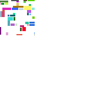

#### Scene
**No PNG input, 800x600**

**No PNG input, 640x480**
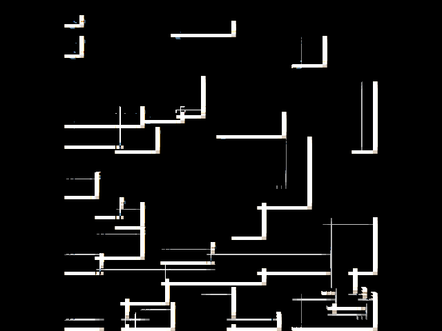

**No PNG input, 320x240**
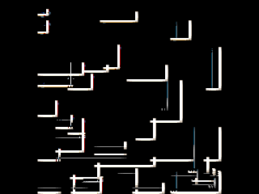

**PNG input: save.png, 320x240**
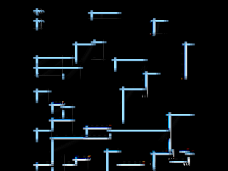

#### WFC

**Rooms tileset - Seed: 999, n: 60**
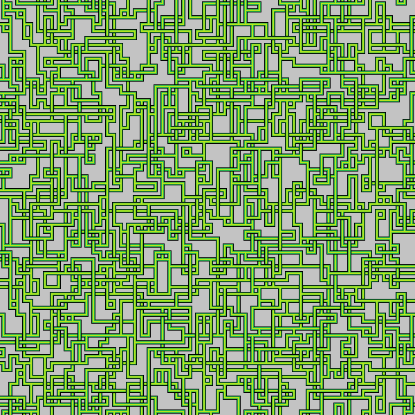

**Rooms tileset - Seed: 100, n: 40**
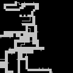

**Rooms tileset - Seed: 1, n: 20**
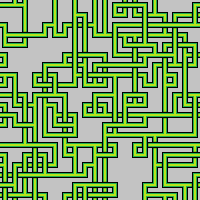

**Rooms tileset - Seed: 42, n: 20**
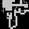

**Knots tileset - Seed: 5, n: 20**
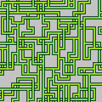

**Knots tileset - Seed: 123, n: 20**
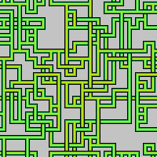

**Circuit tileset - Seed: 7, n: 20**
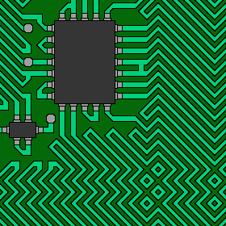

**Circuit tileset - Seed: 88, n: 20**
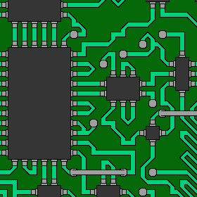

**Castle tileset - Seed: 13, n: 20**
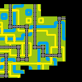

**Castle tileset - Seed: 256, n: 20**
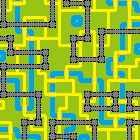

**FloorPlan tileset - Seed: 9, n: 20**
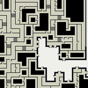

**FloorPlan tileset - Seed: 77, n: 20**
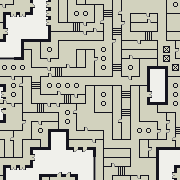

### Design Choices
- Built using Rust + WebGPU (through the `wgpu` crate) because I wanted to explore the technology and build a final project that could be played in a browser. 
- Most of the WebGPU boilerplate is in state.rs right now, which is not ideal. This will be cleaned up a lot for the final project!

### Collaboration/References
No collaboration. The [wgpu learn series](https://sotrh.github.io/learn-wgpu/) was used heavily (I just took a lot of the boilerplate). 

### Known Bugs
- The conversion process from the tiled WFC into a 3d scene has a bug where CTMs are off. This will be fixed for the final project.

### Extra Credit
- 140 points vs. 100 points
